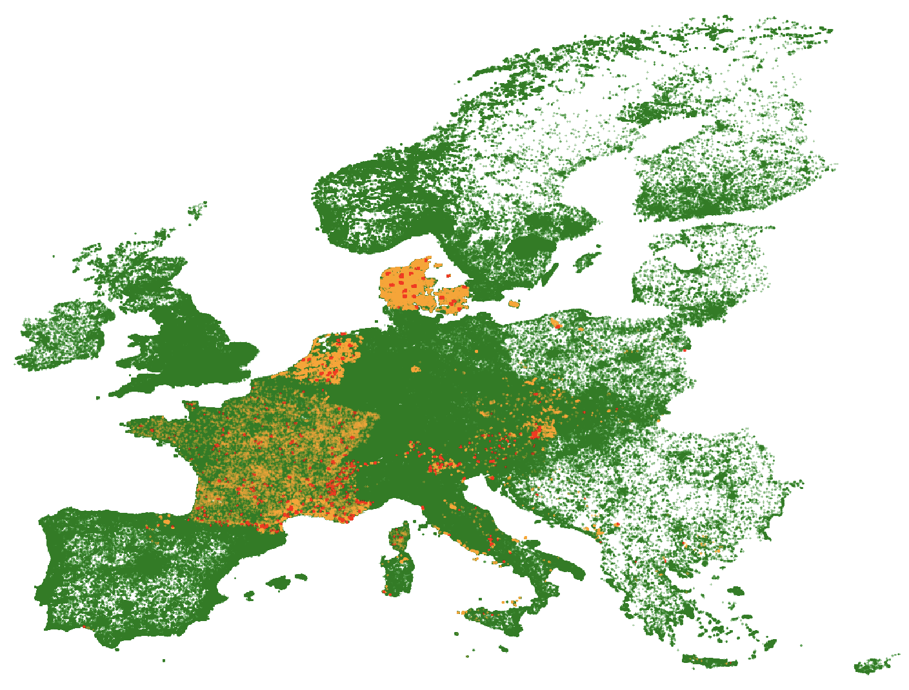

# GeoLifeCLEF 2024

This repository contains the models used for the 2024 GeoLifeCLEF competition as the team
__BernIgen__ (an exceedingly clever name derived from the names of the cities Bern and
Groningen). Our team ranked 5th in this competition. [^ranking]

#### Contents:
1. [Data](#data)
1. [Models](#models)
1. [Evaluation](#evaluation)
1. [Results](#abbreviated-results)

## Data


The data contained a variety of types and sources. [^data] 

- The species-related training data for this study was gathered using two different methods: Presence-Absence (PA) surveys and Presence-Only (PO) occurrences. The different methodolo-
gies resulted in datasets that differed in both scale and utility. 
- Besides species data, we had access to spatialized geographic and environmental data, these
were used as additional input variables.

<p align="center">
    
    <br>
    PA training data (orange), PO data (green) and PA test data (red) plotted by lattitude and longtitude
</p>

The code in this repository expexts the following directory structure for data:


```

.
├── data
│   ├── _raw
│   │   └── <As downloaded from kaggle>
│   └── processed
...
```

### Preprocessing

With the directory structure above the data may be preprocessed by running ```python process_data.py --species <count>``` where ```<count>``` may be replaced by the minimum number of occurrences below which to drop a species ID. If no count is provided it will default to 100.

#### Preprocessing steps

The preprocessing initially generates the ```train.pkl``` and ```test.pkl``` files in the ```data/processed/``` directory. These are generated from the train and test metadata. The data is grouped by surveyId, missing values are replaced with median values and the Country, Region and SpeciesId are one-hot encoded. The train.pkl file contains both the attributes and the speciesId labels. 

Once the metadata is processed, one-dimensional Primary Component Analysis (PCA) is used to reduce the dimensionality of the Environmental Rasters. Here multiple columns comprising rainfall and temperature data over several years are converted into single columns per metric, per month. For example, the rainfall for January 2008, 2009, ..., 2019 is used to generate a single rainfall January column.
All data prior to 2008 is also dropped as some years had extreme weather events that could have excessively influenced the PCA columns.


## Models

Three main models are used. 
1. A Multimodal Model that makes use of ResNet18[^resnet] and Swin_T[^swint]
1. An XGBoost Regression[^xgb] model trained on the preprocessed data using species as labels
1. An XGBoost Regression[^xgb] model trained using species counts as labels 

The outputs of models 1 and 2 consist of matrices of psuedo-probabilities for each species. These psuedo-probabilities are then
weighted _m_:_x_, where _m_ is the multimodal output weight and _x_ is the xgboost output weight. These weighted outputs are combined and then the top _n_+_k_ species are selected based on the species count prediction from model 3. Here _k_ represents a weighting factor applied to the count prediction.

## Evaluation

A micro f1 score was used as the evaluation metric for this project:

$  \text{F1}_{micro} = \frac{1}{N}\sum_{i=1}^N\frac{2 \cdot \text{TP}_i}{2 \cdot \text{TP}_i + \text{FP}_i + \text{FN}_i}$

Where $\text{TP}$ refers to true positives, $\text{FP}$ refers to false positives and $\text{FN}$ refers to false negatives. 


## Abbreviated Results

Some key results from this approach are the following:

| Model          | _k_ = 3| _k_ = 3.5| _k_ = 4 |
|----------------|---------|---------|---------|
| XGB Regression | __0.32234__ | 0.32217 | 0.32233 |
| Multimodal     | 0.32664 | 0.32721 | __0.32762__ |
| Ensemble 1:1   | __0.34378__ | 0.34323 | 0.34329 |
| Ensemble 5:4   | 0.34396 | __0.34407__ | 0.34402 |
_Best score per model in bold_


[^ranking]: [GeoLifeCLEF 2024 Scoreboard on kaggle.](https://www.kaggle.com/competitions/geolifeclef-2024/leaderboard)
[^data]: [The data as well as descriptions of the various types and sources](https://www.kaggle.com/competitions/geolifeclef-2024/data)
[^resnet]: [ResNet18 with PyTorch](https://pytorch.org/vision/master/models/generated/torchvision.models.resnet18.html)
[^swint]: [Swin_T with PyTorch](https://pytorch.org/vision/main/models/generated/torchvision.models.swin_t.html)
[^xgb]: [XGB Regressor](https://xgboost.readthedocs.io/en/stable/python/python_api.html#module-xgboost.sklearn)
